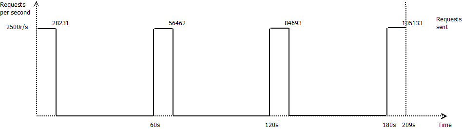
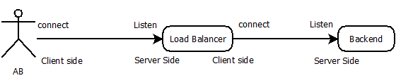

#Conclusions

The tests I run here show that if the client side of reverse-proxy or load-balancer initiates the close of the TCP connection, you will run out of ports and the number of averages requests per second will stuck around 400r/s per backend.  [see load test 2.3.2](../scenarii/bench_tests.md#232---test-with-nginx)

In fact the traffic will run at max speed until you have consume all your available port, then nothing will go out until you reach the 60s timeout for the TIMEWAIT.

So to prevent this issue, it's important the backend close the request first so on server side close the connection as soon as possible after the last write. For HTTP connections with keep-alive you also have to be sure the shorter timeout has to be on the last server of the chain, to be sure it initiates the closing.

On client side, try to wait the server has close the connection before closing it. But you will have to manage a timeout if the server forgot to close it, and you will have to be careful to not closing the socket before reading the data [cf client 4](client.md). 

But to be perfectly those issue doesn't occurs so often, usually just closing the socket just after the last write is enough to win the close race and prevent the issue. But when you are close of the max rate your backend could handle, the problem could appear a drop your performances.
