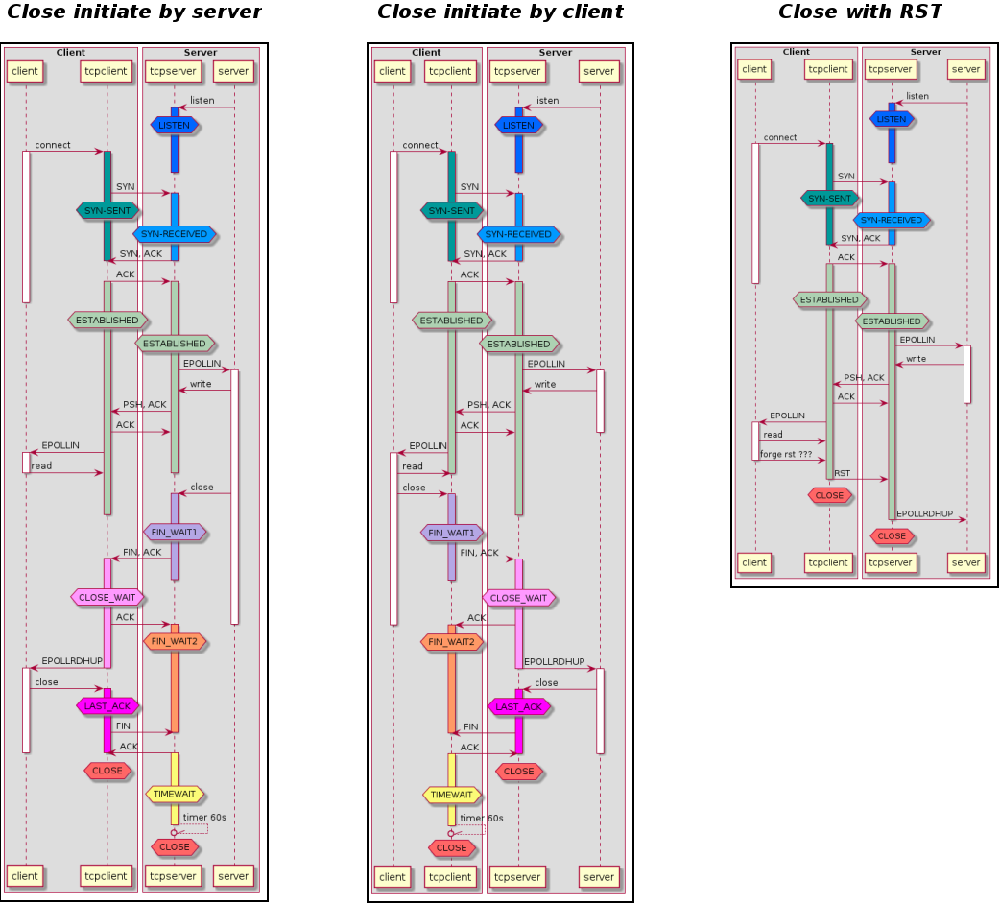

# TCP Protocol
You can find a lot of web sites that speak about TCP/IP on the Internet so I will not try to describe everything. A TCP/IP connection is established between a client that initiate the connection and a server that wait for new clients to connect on it.  

##Some definitions

- The **server** is the one that **listen** on a specific IP and port
- The **client** is the one that **connect** to the server IP and listen port from its own IP and source port.

A TCP/IP connection is identified on both ends (client and server) with the four elements:

1.	Client IP
2.	Client port
3.	Server IP
4.	Server port

In theory the number of available ports is limited to 65536 (16 bits). But in fact it's less. The systems divide the range of available port in 2 big parts. One is affected by the user (the lower part), and one is affected by the server automatically when the client try to establish a connection without providing a source port (the usual way). 

This range is configured using sysctl with the key ```net.ipv4.ip_local_port_range```. For example for the ubuntu container: ```net.ipv4.ip_local_port_range = 32768	60999```

##The state machine
The TCP/IP protocol is defined over IP protocol that only manages the routing of one simple small packet between 2 ends without control that a packet is well arrived. TCP provide a way to send bigger packets in both directions with quality controls to ensure all packets well arrive in the right order.  

Both ends send small packets to each other, some of them are used to transport data when others are just tcp protocol messages. Each message (other than ACK) has to be acknowledged by other ends and each message has a sequence number to identify it. The protocol is a bit more complex and you can check on the Internet for more detailed description.

So each message will changes the state on each ends as the commands execute from the application.

The following sequence diagram show different way for a client and a server to close a TCP/IP connection after establishing it and exchanging one data packet.



The RST packet is not a normal way of closing a socket. On Linux there is no user function to send a RST packet (or at least I don't know one). This feature is usually used when the both state machine are unsynchronized and the client and server don't understand each other. So the one we received the strange packet send a RST to force the deletion of the connection on both ends. 

##The Close Process
The TCP protocol specified that the end that decides to close the connection will have to switch in TIMEWAIT for 60s after receiving the confirmation of the close by the other ends. The other ends will simply destroy all trace of the connection on its side. I don't want to discuss the purpose of this here, it's the TCP protocol and we have to deal with it.

If the Client initiate the Close, the connection (client ip, client port, server ip , server port) will be continue to exist on client side for 60s. So the client will not be able to recreate a new connection from the same IP to this server with the same client port. As we have a limited number of source ports, there is a limit of connection we can establish and close that way on client side.

If the Server initiate the Close (client ip, client port, server ip , server port) will be continue to exist on server side for 60s. But as the client a simply destroy any trace of the connection, it could try to recreate one with the same client ip and port (server ip and port are common to all connection).  In this case the server will accept the incoming connection.
With protocol like HTTP/1.0 each ends know that the connection will be closed when the last packet of the response is processed. So both ends could decide to close the socket without waiting the other end take the initiative. On this case we have a close race that could be win by one, the other or both ends. It arrive sometimes that both ends send their close before receiving the other one. ([]../scenarii/simple_tests.md#test-005--the-close-race)