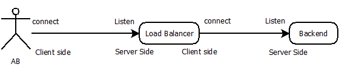
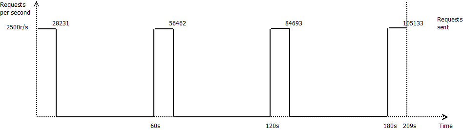
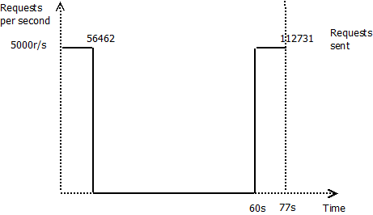

#The bench tests
The goal of those bench tests is to demonstrate the issue that could generate a wrong way of closing TCP/IP connection. The idea is not to evaluate the products we will tests (haproxy, nginx or apache) to determine which one is the best, but to use their different way of managing the socket closing to demonstrate the importance of the understanding of those process.



## 1 - How they close a socket ?

### 1.1 - HaProxy
HAProxy offer several ways to close a socket on its client side and on its server side. The [haproxy documentation](https://www.haproxy.com/doc/aloha/7.0/haproxy/http_modes.html) describes all those modes but we will test them to check how it close the socket on its client side.

#### 1.1.1 - HaProxy mode KAL (default http-keep-alive) 
##### 1.1.1.1 - Client and Server don't close the connection, but send a Connection: close Hedear
Execute the following commands in different terminals

```
docker run -it --rm --name backend timewait/server 6
```

```
docker run -it --rm --link backend:server --name haproxy timewait/haproxy
```


```
docker run -it --rm --name client --link haproxy:server timewait/client 8
```

For this test the client and the server doesn't initiate the close of the socket, but close it if haproxy initiate it. The request is sent with the HTTP header ```Connection: Close```.

The [network capture](haproxy/scenario_haproxy_default_6_8.pcap) show us that the default behavior on HTTP request with ```Connection: close``` is to send a **RST** as a client to reset the connection without TIMEWAIT, and to close it properly on its server side. The FIN, ACK packet is sent with the HTTP response.

##### 1.1.1.2 - Client and Server don't close the connection, but send a Connection: keep-alive
Execute the following commands in different terminals

```
docker run -it --rm --name backend timewait/server 8
```

```
docker run -it --rm --link backend:server --name haproxy timewait/haproxy
```


```
docker run -it --rm --name client --link haproxy:server timewait/client 10
```

The request is sent with the HTTP header "Connection: Keep-Alive".  
After few seconds, we quit the server that initiates the close of the socket on client side of haproxy.  
The connection between client and haproxy stay open.

- [network capture](haproxy/scenario_haproxy_default_8_10.pcap)

#### 1.1.2 - HaProxy mode PCL (httpclose) 
Execute the following commands in different terminals

```
docker run -it --rm --name backend timewait/server 8
```

```
docker run -it --rm --link backend:server --name haproxy timewait/haproxy pcl
```


```
docker run -it --rm --name client --link haproxy:server timewait/client 10
```

The request is sent with the HTTP header ```Connection: Keep-Alive```.  
Haproxy replace this header with ```Connection: close```.  
But as the backend is not a real HTTP server ... it don't care and replies with ```Connection: keep-alive```, and Haproxy send the answer to the client with ```Connection: close```.  
Both of the socket are keep open.  

When we quit the server, it send a close (FIN, ACK) to haproxy that close the socket and initiate the close with the client.

- [network capture](haproxy/scenario_haproxy_httpclose_8_10.pcap)

#### 1.1.3 - HaProxy mode SCL (http\-server\-close) 
Execute the following commands in different terminals

```
docker run -it --rm --name backend timewait/server 8
```

```
docker run -it --rm --link backend:server --name haproxy timewait/haproxy scl
```


```
docker run -it --rm --name client --link haproxy:server timewait/client 10
```

Haproxy force connection close with backend with a RST packet, and keep client open

- [network capture](haproxy/scenario_haproxy_http_server_close_8_10.pcap)

#### 1.1.4 - HaProxy mode FCL (forceclose) 
Execute the following commands in different terminals

```
docker run -it --rm --name backend timewait/server 8
```

```
docker run -it --rm --link backend:server --name haproxy timewait/haproxy fcl
```


```
docker run -it --rm --name client --link haproxy:server timewait/client 10
```

Haproxy force connection close with backend with a RST packet, and close the connection on client side too.

- [network capture](haproxy/scenario_haproxy_forceclose_8_10.pcap)


### 1.2 - Nginx

Execute the following commands in different terminals

```
docker run -it --rm --name backend timewait/server 8
```

```
docker run -it --rm --link backend:server --name nginx timewait/nginx 1
```

```
docker run -it --rm --name client --link nginx:server timewait/client 10
```

By default nginx transform the request to an HTTP/1.0 request and close the connection when it received the response even if the server haven't close the connection on its side

So the socket is stuck in TIMEWAIT on nginx server.

- [network capture](nginx/scenario_nginx_8_10.pcap)

### 1.3 - Apache

Execute the following commands in different terminals

```
docker run -it --rm --name backend timewait/server 8
```

```
docker run -it --rm --link backend:server --name apache timewait/apache
```

```
docker run -it --rm --name client --link apache:server timewait/client 10
```

By default apache transforms the ```Connection: Keep-Alive``` by the header ```Connection: close``` and close the connection when it received the response even if the server hasn't closed the connection on its side

So the socket is stuck in TIMEWAIT on apache server.

- [network capture](apache/scenario_apache_8_10.pcap)

## 2 - The bench tests

### 2.1 - With only one backend server 9
So first I do a series of tests with server 9. In this configuration the server acts as an HTTP server, but wait 0.2ms before closing the connection after sending the HTTP response. When it receives a close event, it closes the connection.

This configuration, allow the other end to win the close race.


Solution | Requests/seconds | Test duration | Request duration 
-------- | ---------------- | ------------- | ---------------- 
[none](#direct-test-without-load-balancer) | 2494 | 48s | 40ms
[HaProxy PCL](#test-with-haproxy-mode-pcl-http_close) | 2512 | 47s | 39ms 
[Nginx](#test-with-nginx) | 572 | 209s | 174ms

#### 2.1.1 - Direct test, without load-balancer.
Execute the following commands in different terminals

```
docker run -it --rm --name backend timewait/server 9
```

```
docker run -it --rm --link backend:server --name ab timewait/ab
```

**The test result :** 

```
Server Software:        fast
Server Hostname:        server
Server Port:            666

Document Path:          /
Document Length:        13 bytes

Concurrency Level:      100
Time taken for tests:   48.101 seconds
Complete requests:      120000
Failed requests:        0
Total transferred:      18480000 bytes
HTML transferred:       1560000 bytes
**Requests per second:    2494.74 [#/sec] (mean)**
Time per request:       40.084 [ms] (mean)
Time per request:       0.401 [ms] (mean, across all concurrent requests)
Transfer rate:          375.19 [Kbytes/sec] received
```

This test gives us a reference to compare the performance with a load-balancer/revers proxy.

#### 2.1.2 - Test with HAProxy mode PCL (http_close)
Execute the following commands in different terminals

```
docker run -it --rm --name backend timewait/server 9
```

```
docker run -it --rm --link backend:server --name haproxy timewait/haproxy pcl
```

```
docker run -it --rm --link haproxy:server --name ab timewait/ab
```

**The test result:**


```
Server Software:        fast
Server Hostname:        server
Server Port:            666

Document Path:          /
Document Length:        13 bytes

Concurrency Level:      100
Time taken for tests:   47.770 seconds
Complete requests:      120000
Failed requests:        0
Total transferred:      18480000 bytes
HTML transferred:       1560000 bytes
**Requests per second:    2512.03 [#/sec] (mean)**
Time per request:       39.808 [ms] (mean)
Time per request:       0.398 [ms] (mean, across all concurrent requests)
Transfer rate:          377.79 [Kbytes/sec] received
```

#### 2.1.3 - Test with NGinx
Execute the following commands in different terminals

```
docker run -it --rm --name backend timewait/server 9
```

```
docker run -it --rm --link backend:server --name nginx timewait/nginx 1
```

```
docker run -it --rm --link nginx:server --name ab timewait/ab
```

**The test result:**

```
Server Software:        nginx/1.10.0
Server Hostname:        server
Server Port:            666

Document Path:          /
Document Length:        13 bytes

Concurrency Level:      100
Time taken for tests:   209.633 seconds
Complete requests:      120000
Failed requests:        14867
   (Connect: 0, Receive: 0, Length: 14867, Exceptions: 0)
Non-2xx responses:      14867
Total transferred:      23077124 bytes
HTML transferred:       4072523 bytes
**Requests per second:    572.43 [#/sec] (mean)**
Time per request:       174.694 [ms] (mean)
Time per request:       1.747 [ms] (mean, across all concurrent requests)
Transfer rate:          107.50 [Kbytes/sec] received

```

Neststat show that there are too many requests in timewait, some errors occurs on Nginx console and no traffic arrives on the backend for around 40s.

```
[crit] 7#7: *239994 connect() to 172.17.0.190:666 failed (99: Cannot assign requested address) while connecting to upstream, client: 172.17.0.192, server: , request: "GET / HTTP/1.0", upstream: "http://172.17.0.190:666/", host: "server:666"
```

The following diagram illustrates how Nginx send request to the backend. As we have sent 120 000 requests, with 14867 errors (not transmitting  to the backend), we have sent to the backend 105133 requests.



### 2.2 - With two backends server 9

To look what happen if we have two backend after the load-balancer and check that we can really use the same source port twice to connect to 2 different servers.

#### 2.2.1 - Test with HAProxy mode PCL (http_close)
Execute the following commands in different terminals

```
docker run -it --rm --name backend1 timewait/server 9
```

```
docker run -it --rm --name backend2 timewait/server 9
```

```
docker run -it --rm --link backend1:server1 --link backend2:server2 --name haproxy timewait/haproxy pcl2
```

```
docker run -it --rm --link haproxy:server --name ab timewait/ab
```

**The test result:**

```
Server Software:        fast
Server Hostname:        server
Server Port:            666

Document Path:          /
Document Length:        13 bytes

Concurrency Level:      100
Time taken for tests:   23.651 seconds
Complete requests:      120000
Failed requests:        0
Total transferred:      18480000 bytes
HTML transferred:       1560000 bytes
Requests per second:    5073.77 [#/sec] (mean)
Time per request:       19.709 [ms] (mean)
Time per request:       0.197 [ms] (mean, across all concurrent requests)
Transfer rate:          763.05 [Kbytes/sec] received
```

So we can manage twice the number of request than with only one backend.

#### 2.2.2 - Test with NGinx
Execute the following commands in different terminals


```
docker run -it --rm --name backend1 timewait/server 9
```

```
docker run -it --rm --name backend2 timewait/server 9
```

```
docker run -it --rm --link backend1:server1 --link backend2:server2 --name nginx timewait/nginx 2
```

```
docker run -it --rm --link nginx:server --name ab timewait/ab
```

**The test result:**


```
Server Software:        nginx/1.10.0
Server Hostname:        server
Server Port:            666

Document Path:          /
Document Length:        13 bytes

Concurrency Level:      100
Time taken for tests:   61.779 seconds
Complete requests:      120000
Failed requests:        0
Total transferred:      20520000 bytes
HTML transferred:       1560000 bytes
Requests per second:    1942.42 [#/sec] (mean)
Time per request:       51.482 [ms] (mean)
Time per request:       0.515 [ms] (mean, across all concurrent requests)
Transfer rate:          324.37 [Kbytes/sec] received
```

The result is much better that we could expected. The reason is not really simple to explain but it's probably because in this configuration the Nginx server loose the race much often.

But with a netstat we can at least confirm that we can use twice the same source port:

```
tcp        0      0 172.17.0.222:35068      172.17.0.202:666        TIME_WAIT   timewait (52.48/0/0)
tcp        0      0 172.17.0.222:35068      172.17.0.210:666        TIME_WAIT   timewait (52.71/0/0)

```

### 2.3 - With two backends server 8

To allow ensuring what occurs with Nginx with 2 backends, I redo the tests with server 8 (doesn't close the connection), so with this one Nginx will always win the close race. We will switch HaProxy from PCL to SCL to force it to close the connection.

#### 2.3.1 - Test with HAProxy mode SCL (http\_server\_close)
Execute the following commands in different terminals

```
docker run -it --rm --name backend1 timewait/server 8
```

```
docker run -it --rm --name backend2 timewait/server 8
```

```
docker run -it --rm --link backend1:server1 --link backend2:server2 --name haproxy timewait/haproxy scl2
```

```
docker run -it --rm --link haproxy:server --name ab timewait/ab
```

**The test result:**

```
Server Software:        fast
Server Hostname:        server
Server Port:            666

Document Path:          /
Document Length:        13 bytes

Concurrency Level:      100
Time taken for tests:   14.196 seconds
Complete requests:      120000
Failed requests:        0
Total transferred:      18480000 bytes
HTML transferred:       1560000 bytes
Requests per second:    8453.24 [#/sec] (mean)
Time per request:       11.830 [ms] (mean)
Time per request:       0.118 [ms] (mean, across all concurrent requests)
Transfer rate:          1271.29 [Kbytes/sec] received
```


#### 2.3.2 - Test with NGinx
Execute the following commands in different terminals


```
docker run -it --rm --name backend1 timewait/server 8
```

```
docker run -it --rm --name backend2 timewait/server 8
```

```
docker run -it --rm --link backend1:server1 --link backend2:server2 --name nginx timewait/nginx 2
```

```
docker run -it --rm --link nginx:server --name ab timewait/ab
```

**The test result:**


```
Server Software:        nginx/1.10.0
Server Hostname:        server
Server Port:            666

Document Path:          /
Document Length:        13 bytes

Concurrency Level:      100
Time taken for tests:   77.090 seconds
Complete requests:      120000
Failed requests:        7269
   (Connect: 0, Receive: 0, Length: 7269, Exceptions: 0)
Non-2xx responses:      7269
Total transferred:      21770268 bytes
HTML transferred:       2788461 bytes
Requests per second:    1556.62 [#/sec] (mean)
Time per request:       64.242 [ms] (mean)
Time per request:       0.642 [ms] (mean, across all concurrent requests)
Transfer rate:          275.78 [Kbytes/sec] received
```

As we have 7269 failed requests, we have send to the backend 112 731 requests, which is less than 4*28231.


