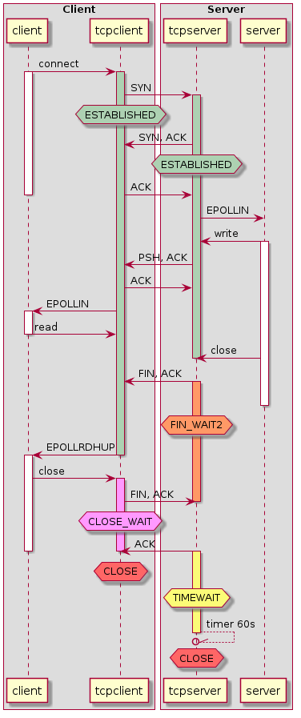

## Test 000 : server 1 - client 0 - Server write a bip and close the connection

A simple test where client establish the connection. The server then send a bip and close the connection. The client read the bip and close the socket when it detetect the close event.  
Then the client restart the sequence using same ports, and it works even if the connection is in TIMEWAIT on server side. On client side, the socket in destroy after the close, so for the client it is not an issue to use the same port.



So closing the connection on server side first allow the client to reuse the port.


## test 001 : server: 3 - client:0 Keep connections open
The idea of this scenario is to check that we can't established 2 sockets in destination of 2 differents host from the same source port.
We start two server in two differents containers in two terminals:
./timewait_server -p 667 -s3
./timewait_server -p 668 -s3

And we try to start 2 clients from the same container
./timewait_client -c 667 -f 666 -t 172.17.0.1 -s 0
./timewait_client -c 668 -f 666 -t 172.17.0.2 -s 0

The first one will established
The second will failed, even the destination host and port are different

So this demonstrate we are limited on how much simultaneous connections we can established from a host with the number of available port on an interface.

We can also saw that a Ctrl+C on client where the connection is established generated a FIN, ACK packet and close the socket.


## test 002 : server: 4 - client: 0 Not closing socket properly
so we start server on scenario 4, client on scenario 0
then after 13s, we type Ctrl+C on client and after 25s Ctrl+C on server
On scneario.pcap file we saw that two Ctrl+C generate the apropriate FIN, ACK packet to close the connection.

## test 003 : server: 3 - client: Close initiate by client
The client failed to create second socket : error 98 : Address already in use
The socket is in timewait on client side
tcp        0      0 172.17.0.3:666          172.17.0.1:667          TIME_WAIT   timewait (50.36/0/0)

So we have to wait 60s after the close to be able to reuse the port.
As we can see in the scenario.pcap file the close process is correct, but initiate by the client.

on Ubuntu container: net.ipv4.ip_local_port_range = 32768	60999
so we have only 28231 ports available to open a socket from an IP. If it's the client that initiate the close of the sockets, we have to wait 60s to reuse the port so we are limited to 470 requests per second.

## test 004 : server 5 - client 6 Sending data on socket closed by other end
The idea is to send data on a socket after receiving the close event generate by the close socket on the other end.
On the scenario.pcap we see that the client that initiate the close send a RST packet to force the close of the socket on the server side even we don't call the close on the application side.


## test 005 : server 1 - client 7 The close race
For this test, the server accept connection, send data and close, the client connect, read data and close. So both client and server try to close the conenction after doing what it has to data with the data. This generate a race with unpredicable result.
For example if you look at the both client and server caprure for the same echange, we saw that on both end the local program send its close before receiving the other one. So both end close the socket first and both ends have the socket in TIMEWAIT.

## test 006 : server 2 - client 5 Delay the close
The server accept the connection, send a bip and wait 5s to close the connection
The client connect to server, received the EPOLLIN event then wait 10s, read the data and close the connection

It quite the same than test 001 but all to see the intermediate state of the connections


## test 007 : server 1 - client 1 Client delay the read
The server accept the connection, send a bip and close the connection.
The client connect to server, received the EPOLLIN event then wait 10s, read. When it waiting to read it detect the server has close the connection so it close it too.
But as there are unread data for this socket, the client decide to destroy the socket with a RST packet instead of a FIN one.

The result is the socket is destroy on both end, no TIMEWAIT.


## test 008 : default haproxy with Server 6 and Client 8
For this test the client and the server doesn't initiate the close of the socket, but close it if haproxy initiate it
The request is sent with the HTTP header "Connection: Close"

The network capture show us that the default behavior on HTTP request with Connection close is to send a RST as a client to reset the connection without TIMEWAIT, and to close it propeperly on its server side
the FIN, ACK packet is sent with the HTPP response.

To run the test, start in 4 terminals  
```
docker run -it --rm --name backend timewait/server 6
docker run -it --rm --link backend:server --name haproxy timewait/haproxy
docker exec -it haproxy tcpdump -s0 -w scenario_haproxy_default_6_8.pcap port 666
docker run -it --rm --link haproxy:server timewait/client 8
```

## test 009 : default haproxy with Server 8 and Client 10
The request is sent with the HTTP header "Connection: Keep-Alive"
After few second, we quit the server that initiate the close of the socket on client side of haproxy
The connection between client and haproxy stay open

## test 010 : httpclose haproxy with Server 8 and Client 10
The request is sent with the HTTP header "Connection: Keep-Alive"
Haproxy replace this header with "Connection: close"
But as the backend is not a real HTTP server ... it don't care and replys with Connection: keep-alive"
And Haproxy send the answer to the client with "Connection: close".  
Both of the socket are keep open.  

When we quit the server, it send a close (FIN, ACK) to haproxy that close the socket and initiate the close with the client

## test 011 : httpclose haproxy with Server 6 and Client 10
Same as test 010 but this time server answer with a proper Connection: close

Same behavior


## test 012 : http-server-close haproxy with Server 8 and Client 10
Haproxy force connection close with backend with a RST packet, and keep client open

## test 013 : closeclose haproxy with Server 8 and Client 10
Haproxy force connection close with backend with a RST packet, and close client side
