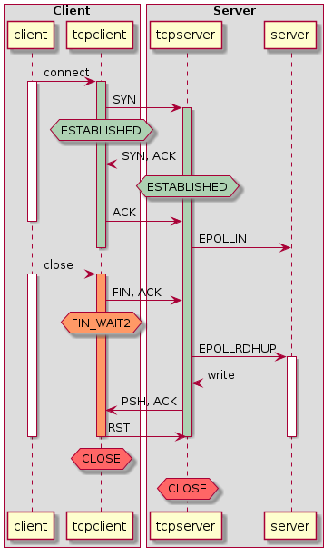
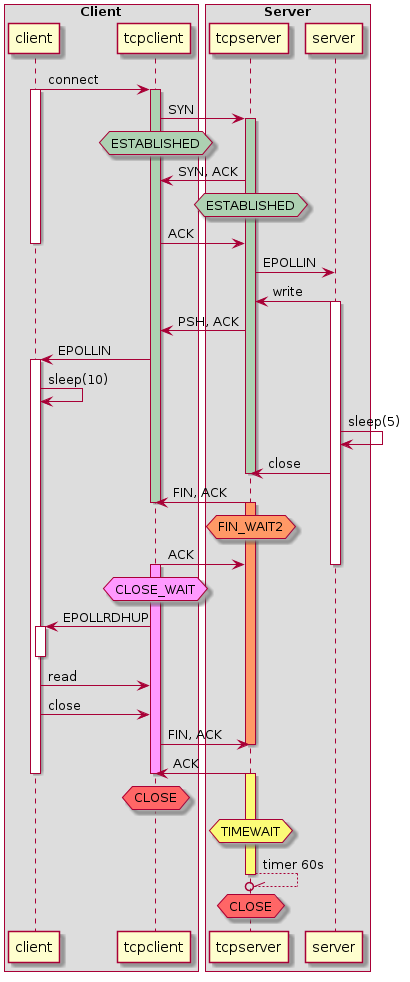

[test 004 : Sending data on socket closed by other end](#test-004-:-Sending-data-on-socket-closed-by-other-end)


## Test 000 : Server write a bip and close the connection
Execute the following commands in different terminals

```
docker run -it --rm --name backend timewait/server 1
```

```
docker run -it --rm --name client --link backend:server timewait/client 0
```


The client establishes the connection. The server then sends a bip and closes the connection. The client reads the bip and closes the socket when it detects the close event.  
Then the client restart the sequence using same port source, and it works even if the connection is in TIMEWAIT on server side. On client side, the socket in destroy after the close, so for the client it is not an issue to use the same port.


So closing the connection on server side first allow the client to reuse the port.


## test 001 : Use the same source port twice simultaneously
Execute the following commands in different terminals

```
docker run -it --rm --name backend1 timewait/server 3
```

```
docker run -it --rm --name backend2 timewait/server 3
```

```
docker run -it --rm --name client --link backend1:server --link backend2:server2 timewait/client 0
```

```
docker exec -it client ./timewait_client -c 666 -f 667 -t server2 -s 0
```

In this scenario we try establishing 2 connections from the same client, using the same source port to two different servers with different IP.

The second connection will failed. It is not the demonstration we can't establish two connections with the same source ip/port to two different servers.

The problem is we execute the connection following 3 steps [client.cpp](../src/client.cpp):

1. We create a socket (no source, no target) ... line 72
2. We bind the source port of this socket ...... line 84
3. We connect to the target server ............. line 89

The problem is taht at the bind step, we don't know the target, only the source. So bind return an error because the port is already in use. But if we don't try to do the bind and let the system choose the port it will worked.

For example during bench test we have on the same host :

```
tcp        0      0 172.17.0.222:35068      172.17.0.202:666        TIME_WAIT   timewait (52.48/0/0)
tcp        0      0 172.17.0.222:35068      172.17.0.210:666        TIME_WAIT   timewait (52.71/0/0)
```


## test 002 : Stopping the program could close the connection
Execute the following commands in different terminals

```
docker run -it --rm --name backend timewait/server 4
```

```
docker run -it --rm --name client --link backend:server timewait/client 0
```


We start server on scenario 4, client on scenario 0  
After 13s, we type Ctrl+C on client and after 25s Ctrl+C on server  
On [scneario.pcap](4_0/scenario.pcap) file we saw that two Ctrl+C generate the apropriate FIN, ACK packet to close the connection.

## test 003 : Close initiate by client
Execute the following commands in different terminals

```
docker run -it --rm --name backend timewait/server 3
```

```
docker run -it --rm --name client --link backend:server timewait/client 6
```

The client failed to create second socket : ```error 98 : Address already in use```.  
The socket is in timewait on client side
```
tcp        0      0 172.17.0.3:666          172.17.0.1:667          TIME_WAIT   timewait (50.36/0/0)
```

So we have to wait 60s after the close to be able to reuse the port.
As we can see in the [scenario.pcap](3_6/scenario.pcap) file the close process is correct, but initiate by the client.

on Ubuntu container: ```net.ipv4.ip\_local\_port\_range = 32768	60999```
so we have only 28231 ports available to open a socket from an IP. If it's the client that initiate the close of the sockets, we have to wait 60s to reuse the port so we are limited to 470 requests per second.

## test 004 : Sending data on socket closed by other end
Execute the following commands in different terminals

```
docker run -it --rm --name backend timewait/server 5
```

```
docker run -it --rm --name client --link backend:server timewait/client 6
```

The idea is to send data on a socket after receiving the close event generate by the close socket on the other end.  
On the [scenario.pcap](5_6/scenario.pcap) we see that the client that initiate the close send a RST packet to force the close of the socket on the server side even we don't call the close on the application side.



## test 005 : The close race
Execute the following commands in different terminals

```
docker run -it --rm --name backend timewait/server 1
```

```
docker run -it --rm --name client --link backend:server timewait/client 7
```

For this test, the server accept connection, send data and close, the client connect, read data and close. So both client and server try to close the conenction after doing what it has to data with the data. This generate a race with unpredicable result.  
For example if you look at the both client and server capture for the same echange, we saw that on both end the local program send its close before receiving the other one. So both end close the socket first and both ends have the socket in TIMEWAIT.

- [scenario_client.pcap](1_7/scenario_client.pcap)
- [scenario_server.pcap](1_7/scenario_server.pcap)

## test 006 : server 2 - client 5 Delay the close
Execute the following commands in different terminals

```
docker run -it --rm --name backend timewait/server 2
```

```
docker run -it --rm --name client --link backend:server timewait/client 5
```

The server accept the connection, send a bip and wait 5s to close the connection.  
The client connect to server, received the EPOLLIN event then wait 10s, read the data and close the connection

It quite the same than test 001 but allaw to see the intermediate states of the connections



## test 007 : Client delay the read
Execute the following commands in different terminals

```
docker run -it --rm --name backend timewait/server 1
```

```
docker run -it --rm --name client --link backend:server timewait/client 1
```

The server accept the connection, send a bip and close the connection.
The client connect to server, received the EPOLLIN event then wait 10s, and try to read. When it waiting to read it detect the server has close the connection so it close it too.
But as there are unread data for this socket, the client decide to destroy the socket with a RST packet instead of a FIN one.

The result is the socket is destroy on both end, no TIMEWAIT.

When it try to read, the data has been destroyed.


